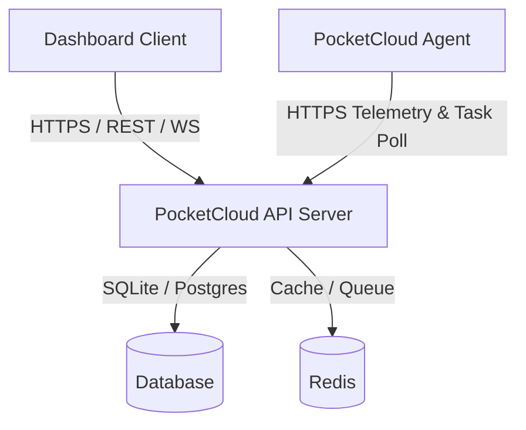

# ⚡ PocketCloud

[](LICENSE)
[]()
[]()

PocketCloud is a premium, self-hosted control plane for managing distributed Linux VPS infrastructure. It allows you to pair server nodes, monitor real-time telemetry, execute allow-listed maintenance actions, capture environment blueprints, and perform 1-click server migrations.

## 🚀 One-command deployment

On a fresh Ubuntu/Debian VPS, run:

```bash
curl -fsSL https://raw.githubusercontent.com/designx-studio/pocketcloud/main/deploy/install.sh | sudo bash
```

The installer installs Docker when needed, downloads PocketCloud, generates production secrets, starts PostgreSQL, Redis, the API, workers, dashboard, and Caddy, then prints the dashboard URL. For a private repository, clone or download the repository first and run `sudo bash deploy/install.sh`; the public curl command requires the installer URL to be publicly reachable.

To deploy a custom domain or repository ref:

```bash
curl -fsSL https://raw.githubusercontent.com/designx-studio/pocketcloud/main/deploy/install.sh | sudo POCKETCLOUD_DOMAIN=cloud.example.com POCKETCLOUD_REF=main bash
```

## 🚀 Key Features

- 🖥️ **Multi-VPS Fleet Management**: Pair any Linux VPS node with an outbound systemd agent.
- 📊 **Real-time Telemetry & Metrics**: Monitor CPU, memory, disk usage, uptime, and load in a unified dashboard.
- 🛠️ **Secure Dispatch Pipeline**: Execute maintenance actions (Docker installation, dev tools setup, package updates, system reboots) via an encrypted, agent-polled connection.
- 📦 **Declarative Blueprints**: Capture complete environment manifests (installed packages, systemd services, env vars, cron jobs) with automatic secret redaction (`[REDACTED]`).
- ⚡ **1-Click Migration**: Replicate or restore a blueprint onto any online server node instantly.
- 🧠 **AI Diagnostics & Sanitizer**: Automatically scan, sanitize raw logs, and recommend solutions for infrastructure issues.
- 💾 **Disaster Recovery**: Export and import complete control plane states as portable JSON archives.

## 🏗️ Architecture

PocketCloud uses an outbound-only connection model. The agent running on target VPS nodes polls the control plane for tasks, eliminating the need to expose open ports or configure complex VPNs.



## ⚙️ Local development

```bash
cp .env.example .env
npm install
npm run db:push
npm run dev
```

Dashboard: `http://localhost:3000`, API: `http://localhost:8080`.

## Running tests & verification

```bash
npm run lint
npm run build
npm run test
```

## 📁 Repository Structure

- `apps/api`: The primary Fastify API server, worker pipeline, database models, and agent communication layer.
- `apps/web` (and root `index.html`): The premium Glassmorphism control panel client.
- `agent`: The pocket-size agent binary written in Go with an automatic systemd installer.
- `packages/blueprint`: Environment spec validator, parser, and secret sanitizer.
- `deploy`: Docker Compose orchestration, Caddy reverse-proxy configuration, and production deployment scripts.
- `docs`: Multi-page documentation covering architecture, API, security, and blueprint specifications.

## 🔒 Security

- **Agent Hardening**: Enforces systemd sandbox parameters (`NoNewPrivileges=true`, `ProtectSystem=strict`, etc.).
- **Server Isolation**: Strict authorization validation prevents agents from accessing or modifying tasks that do not belong to their assigned `serverId`.
- **Argon2id Hashing**: Standard password security using memory-hard Argon2id parameters.
- **Audit Logging**: Fully compliant, immutable audit trails tracking all administrative actions.

## 📄 License

PocketCloud is open-source software licensed under the [MIT License](LICENSE).
